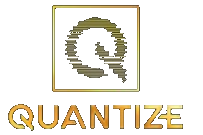

# Adapter-LoRa for Quantization  

<div align="center">
  

[](https://github.com/youness-elbrag/AdapterLoRa/)
[](https://github.com/youness-elbrag/AdapterLoRa/issues) 
[](https://github.com/youness-elbrag/AdapterLoRa/network) 
[](https://github.com/youness-elbrag/AdapterLoRa/stargazers) [](https://github.com/youness-elbrag/AdapterLoRa/blob/master/LICENSE)
</div>


If the last 6 months of AI research felt like a decade to you, you are not alone! With a new Large Language Model (LLM) released every other week, it has been challenging to keep up with the current pace of innovation in AI. While there many LLM model which not Non-Hungging Face model Hard to Quantize the model if realsed as Pre-trianed model , Adapter-LoRa is Tool help to Assign **nn.LInear-** to LoRa Linear Decompsition 

### Instalation 

```python
pip install AdapterLoRa
```

### Usage Tool AdpaterLoRa

```python

import torch.nn as nn
import torch
from core.Quantized import AdapterLoRa

model = nn.TransformerEncoderLayer(d_model=512, nhead=8)

Adpate_model = AdapterLoRa(model , method="LoRa", Rank=4)

# adding Linear Layer buitl Self.attention 
Adpate_model.add_layer("self_attn") 
Adpate_model.add_layer("linear1")
Adpate_model.add_layer("linear2")

# reconstruct model Quantized 
Adpate_model.reconstruct_model()

# Iplmented LoRa Method
model = Adpate_model.implement_lora(verbose=True)
# Total trainable parameters before LoRA: 3176960
# Total trainable parameters after LoRA: 24576

# This sets requires_grad to False for all parameters without the string "lora_" in their names

# Training loop
for batch in dataloader:
    model.train()
```
### Saving Wieghts model 

* Save LoRA model (only the LoRA matrixes will be saved).

```python
import loralib as lora 
# ===== Before =====
# torch.save(model.state_dict(), checkpoint_path)
# ===== After =====
torch.save(lora.lora_state_dict(model), checkpoint_path)
```

### Loading the Pre-Trained Model 

* Load LoRA model (need to load the pre-trained model first).

```python
import loralib as lora 
# Load the pre-trained checkpoint first
model.load_state_dict(torch.load('ckpt_pretrained.pt'), strict=False)
# Then load the LoRA checkpoint
model.load_state_dict(torch.load('ckpt_lora.pt'), strict=False)
```


-  Quantized Model 

-  Time to Train 

-  Cost to Train 


## What's in it for you?

For each of the above four pillars, we are sharing our codebase and insights to:
- Assist you to leverage Transfomer-Based Model for your machines needs and challenges

- Boost reproducibility efforts which are becoming increasingly difficult with Transfomers 

i am providing Tool that are ready-to-use for Quantize the model:

- Finetuning Transfomer-Based on your proprietary dataset via PeFT methodologies such as LoRA and QLoRa

- Performing hyperparameter optimization to get the maximum performance out of these models

## What's the best way to use this repository?

Go over to the Transfomer-Based-specific directory that you are interested in, and open the ```README.md```. We have included details about the LLMs, followed by performance results on open-source datasets!

## Roadmap

Our plan is to perform these experiments on all the LLMs below. To that end, this is a tentative roadmap of the LLMs that we aim to cover:

- [x] TransfomerEncoder
- [x] TransfomerDecoder
- [x] Vision-Transfomer
- [ ] BioMedGPT **Under Progress**
- [ ] SalesForce XGen **Under Progress**
- [ ] OpenAI GPT-2 **Under Progress**
- [ ] Inflection Pi **Under Progress**

## Correspondence

If you have any questions or issues, or would like to contribute to this repository, please reach out to:

- Youness ELbrag ([Email](younsselbrag@gmail.com) | [LinkedIn](https://www.linkedin.com/in/youness-el-brag-b13628203/))


